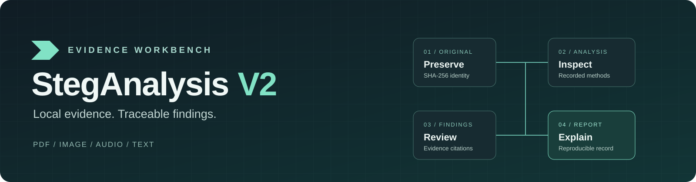
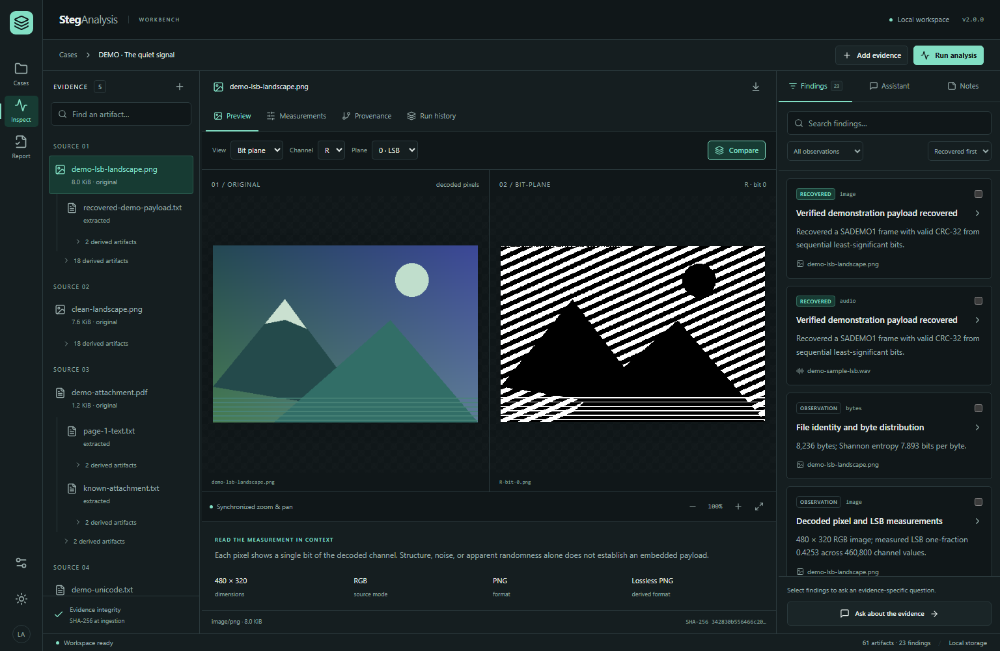
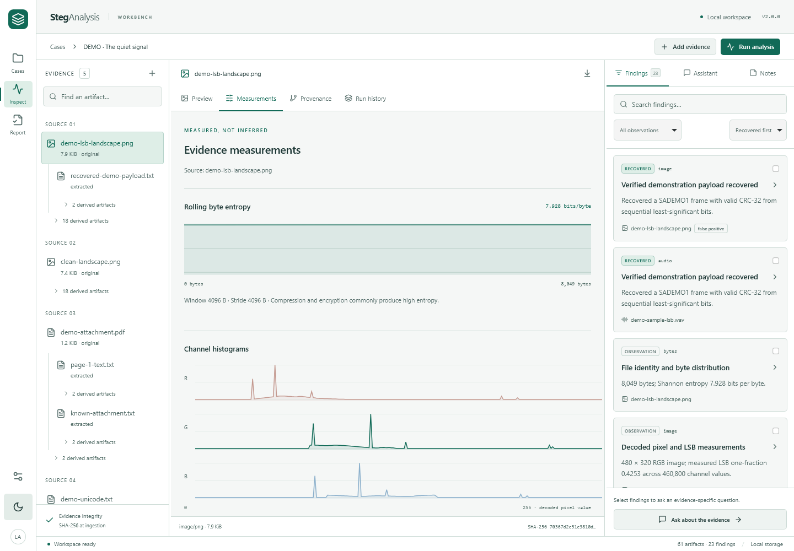
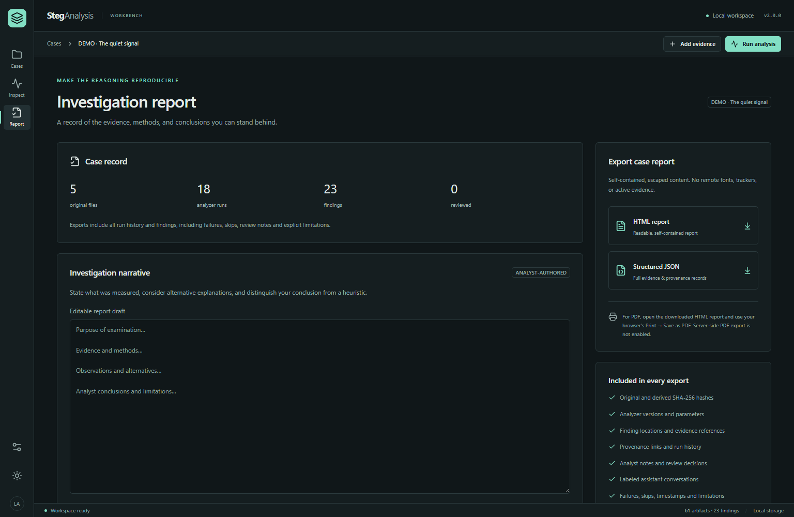
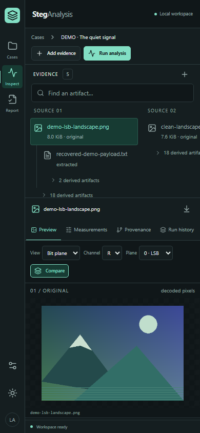
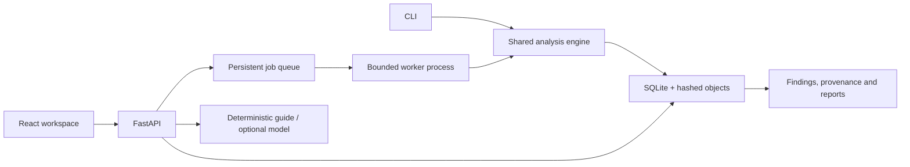

# StegAnalysis V2 · AI-Assisted



[](https://github.com/AlBrmagawi/StegAnalysis-V2-AI-Assisted/actions/workflows/checks.yml)


**A forensic investigation workspace for PDFs, images, PCM audio and text—with optional, evidence-scoped AI assistance.**

Preserve original bytes, inspect measured findings, follow artifact provenance, record analyst decisions, and export a reproducible case report. Native analysis and the deterministic evidence guide work offline without a model, GPU or API key. Optional local and hosted models produce labeled drafts with validated evidence citations.

[Quick start](#quick-start) · [Capabilities](#capabilities) · [Verification](#verification) · [Documentation](#architecture-and-documentation) · [Contributing](CONTRIBUTING.md) · [Security](SECURITY.md)

Original creators: **Mohamed Abdelgalil (AlBrmagawi)** and **Spooky**. Their attribution is retained throughout the application. [Project licensing remains undeclared](docs/provenance-and-licensing.md#licensing-status); this repository does not introduce a new license.

## The investigation workspace



An actual investigation of generated benign fixtures: synchronized image inspection, recorded findings and artifact-level provenance. The recovered payload uses intentionally embedded, CRC-checked demonstration framing.

<details>
<summary>More views: measurements, reports and mobile layout</summary>

| Measured evidence | Investigation report |
|---|---|
|  |  |



</details>

## Why the workbench exists

- **Preserve the source.** SHA-256 identity, immutable originals by application contract, verified duplicate uploads and separate derived artifacts.
- **Keep the reasoning inspectable.** Every finding links to an analyzer run, parameters, location, supporting evidence and limitations.
- **Make assistance accountable.** A deterministic guide is always available; model output is labeled, case-scoped and citation-validated. Hosted requests require review of the exact outgoing payload.
- **Carry the case through.** Persistent jobs, cancellation/retry, analyst notes, review decisions and self-contained HTML/JSON reports.

## Quick start

Prerequisites: Python 3.12–3.14 (3.12 tested), [uv](https://docs.astral.sh/uv/getting-started/installation/), Node 24 LTS, npm. No GPU, API key, model, or optional external tool is required.

```sh
git clone https://github.com/AlBrmagawi/StegAnalysis-V2-AI-Assisted.git
cd StegAnalysis-V2-AI-Assisted
uv sync --frozen
cd frontend
npm ci
npm run build
cd ..
uv run steganalysis fixtures
uv run steganalysis demo
uv run steganalysis serve
```

Open **http://127.0.0.1:8000**. The demo command creates a labeled case through the same engine used by real uploads. Data persists in `.data/`; keep that directory private. Do not run more than one API process against the same data directory.

If port 8000 is already in use, open the running instance or stop it before restarting. `steganalysis serve` checks the port before opening case storage, so a failed second launch leaves existing jobs untouched. To run a separate instance, choose both a different `--port` and a different `STEG_DATA_DIR`.

On Windows, use `npm.cmd` and `npx.cmd` if PowerShell blocks the `.ps1` shims. After installing the environment, you can also start it directly:

```powershell
& .\.venv\Scripts\steganalysis.exe serve
```

For hot-reload development, run `uv run steganalysis serve` in one terminal and `npm run dev` in `frontend/` in another. Use http://127.0.0.1:5173; Vite proxies same-origin `/api` requests.

## Docker Compose

```sh
docker compose up --build -d
docker compose exec workbench steganalysis demo
```

Open http://127.0.0.1:8000. Stop any native server using that port first. Compose uses a named evidence volume, a non-root process, a read-only root filesystem, limited memory/CPU/processes, and a network without outbound connectivity. It never mounts the Docker socket or your host home directory. `docker compose down` retains the evidence volume. Do not add `-v` unless you intend to delete it.

The Docker image bases are pinned by digest, Python runtime dependencies are hash-locked in `requirements.lock`, and JavaScript dependencies are locked in `frontend/package-lock.json`. See [installation](docs/installation.md) and [security boundaries](docs/security.md).

## Capabilities

| Area | Implemented behavior | Deliberate limits |
|---|---|---|
| Cases and jobs | SQLite migrations, immutable originals, SHA-256 deduplication, persistent run history, one worker, SSE stages/counts, cancellation and retry | Single-user local service; no multi-tenant authentication |
| All inputs | Actual signature checks, bounded ASCII strings, configurable rolling Shannon entropy | Byte observations are not detection probabilities |
| PDF | Parser-based metadata/pages/text/images/attachments, page/object provenance, parsed revision links, trailing-data inspection | No OCR, JavaScript execution, visual page rendering, or password recovery |
| Images | Metadata, decoded previews, RGBA channels, histograms, bit planes, negative/grayscale/median residual, bounded LSB and chi-square measurements | 12 million pixels; deliberate 16-bit PNG unsupported state; no JPEG DCT-domain detector |
| WAV | Integer PCM 8/16/24/32-bit, waveform, spectrogram, sample bits, bounded inspection | Up to 8 channels; float/compressed WAV unsupported |
| Text | Whitespace, invisible Unicode, exact character/UTF-8 positions and context | UTF-8; benign formatting explanations retained |
| External tools | Explicit Binwalk, zsteg and Steghide information adapters with version/invocation/exit/output/deadline records | Optional installs; no automatic carving, password guessing, or legacy executables |
| Investigation | Search/filter/sort, synchronized image zoom/pan, channel/plane selection, navigable provenance, finding review and persistent notes | Derived graphs show recorded relationships only |
| Assistant | Labeled deterministic evidence guide; optional local Ollama and hosted compatible providers; validated citations and per-request hosted consent | Citation validation does not prove model prose is correct; no shell/tool execution |
| Experimental ML | Source-group splits, reproducible features, training-only scaling, logistic training/evaluation, JSON weights and inference | No model shipped/enabled; synthetic baseline has high false positives |
| Reports | Self-contained escaped HTML, structured JSON, notes, versions, parameters, failures/skips and assistant authorship | Browser Print → Save as PDF; no server PDF renderer |

### CLI

```sh
uv run steganalysis doctor
uv run steganalysis analyze -f demo-fixtures/demo-attachment.pdf --profile standard -o .data/cli
uv run steganalysis analyze -f demo-fixtures/demo-unicode.txt --profile quick --json
uv run python script.py -f demo-fixtures/demo-sample-lsb.wav
```

Reports are written to a unique case directory under the output path. JSON stdout contains the structured report. Failed, timed-out, and cancelled jobs return a nonzero exit code. Missing optional tools have explicit skipped records and are never reported as a successful negative check.

### Optional assistant and ML

The core works offline without either. See [assistant configuration and privacy](docs/assistant.md), [.env.example](.env.example), and [the experimental ML protocol](docs/ml.md). Secrets are server-side. `.env` is not loaded implicitly.

```sh
uv run --group ml steganalysis ml dataset --output ml-output/dataset
uv run --group ml steganalysis ml train --manifest ml-output/dataset/manifest.json --output ml-output/model.json
uv run --group ml steganalysis ml predict --model ml-output/model.json --image demo-fixtures/clean-landscape.png
```

These commands run a synthetic experiment, not a field-ready detector. The recorded 60-source run yielded test ROC-AUC **0.6204** and false-positive rate **0.875** at its validation-selected threshold; this is why no default weights or detection claims are shipped. Use independently sourced, permissioned natural images to evaluate any real intended use.

## Verification

The local QA pass used generated benign inputs and exercised real parsers, worker processes, the API, CLI and production frontend.

| Check | Recorded result |
|---|---|
| Python suite, Windows | **98 passed**, one symlink-permission skip |
| Python suite, restricted Linux container | **99 passed**, including the symlink check |
| Chromium, Firefox and WebKit | **51 passed** across 17 journeys per browser |
| Python statement / branch coverage | **89.04% / 75.77%** |
| Production container HTTP workflow | **18 analyzer runs**, 23 findings, SSE progress and HTML/JSON export |
| Static checks and distribution | Ruff, mypy, ESLint, TypeScript, production build, strict docs and fresh wheel installation passed |

The workflow badge reports GitHub-hosted CI separately. See the [full verification record](docs/verification.md) for the seven corrected QA defects, methodology and unverified integrations. Automated accessibility checks cover dark/light themes, keyboard interactions and 320/768/1536-pixel layouts; they do not replace manual screen-reader assessment.

Reproduce the checks:

```sh
uv sync --frozen --group ml
uv run --group ml pytest --cov --cov-report=term-missing -q
uv run ruff check steganalysis tests scripts script.py
uv run mypy steganalysis
cd frontend
npm run lint
npm run build
npx playwright install chromium firefox webkit
npm run test:e2e
cd ..
uv run mkdocs build --strict
```

Browser tests start their own production server on loopback port 18765 with temporary case storage and a freshly analyzed demo. They leave your `.data/` cases and port 8000 alone. All three browser engines run by default; use `npm run test:e2e -- --project=chromium` for a focused run. See [test commands and coverage](docs/testing.md) and the [verification record](docs/verification.md) for executed checks, screenshots, and limitations.

## Architecture and documentation



| Directory | Responsibility |
|---|---|
| [`steganalysis/`](steganalysis/) | Shared engine, native analyzers, storage, workers, API/CLI, assistant and reports |
| [`frontend/`](frontend/) | React/TypeScript workbench and three-browser Playwright tests |
| [`tests/`](tests/) | Parser, integrity, process, API, assistant, ML and QA regression tests |
| [`docs/`](docs/) | Architecture, methods, interpretation, setup and verification |
| [`deploy/`](deploy/) | Loopback container gateway configuration |

Documentation source lives in `docs/`; `site/` is generated locally and excluded from version control.

- [Workflow and API examples](docs/usage.md)
- [Architecture and provenance contracts](docs/architecture.md)
- [Analysis methods and interpretation](docs/analyzers.md)
- [Security, isolation and privacy](docs/security.md)
- [Audit, dependency provenance and licensing](docs/provenance-and-licensing.md)
- [Development record](PROGRESS.md)
- [Changes in V2](CHANGELOG.md)

There is no universal steganography detector here. Observations, heuristic indicators, verified demo recovery, experimental model scores, and analyst conclusions remain separate.


## Contributing and support

Use the [contribution guide](CONTRIBUTING.md) for setup, tests and change expectations. Report reproducible bugs or propose workflows through the [issue templates](https://github.com/AlBrmagawi/StegAnalysis-V2-AI-Assisted/issues/new/choose). Use generated or sanitized inputs; keep case data, reports and provider credentials private. Follow the [security reporting policy](SECURITY.md) for vulnerabilities.

This V2 repository builds on [AlBrmagawi/steganalysis](https://github.com/AlBrmagawi/steganalysis). Credit remains with **Mohamed Abdelgalil (AlBrmagawi)** and **Spooky**. Legacy executables and sample PDFs are excluded from the published V2 tree; the [provenance record](docs/provenance-and-licensing.md) documents their origin and hashes.
