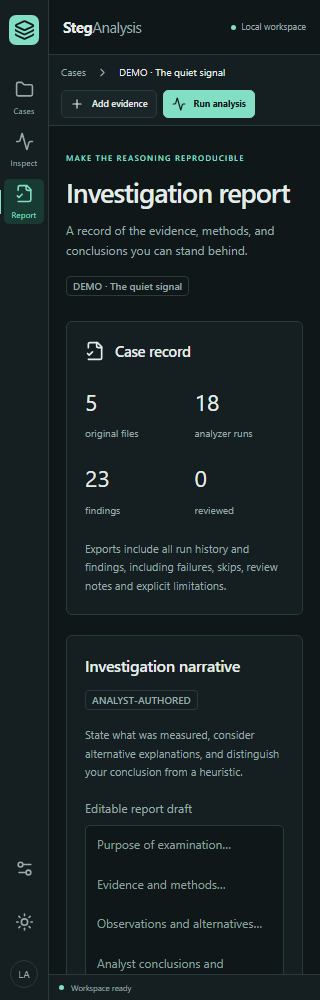

# Verification record

Rebuild environment: Windows, managed Python 3.12.14, Node 24.18.0, Docker Desktop engine 29.6.2. Only newly generated benign fixtures were analyzed. Neither committed executable nor either original sample PDF was run or parsed.

This record describes the local QA pass before V2 publication. Current hosted results are available in [GitHub Actions](https://github.com/AlBrmagawi/StegAnalysis-V2-AI-Assisted/actions/workflows/checks.yml); local results and hosted runs are separate evidence.

## Executed checks

| Check | Outcome |
|---|---|
| Python parser/engine/API/provider/process/ML tests, Windows | 98 passed, 1 skipped; Windows cannot create the real symlink fixture without developer mode/elevation |
| Same Python suite, restricted Linux container | 99 passed; includes the real symlink check |
| Python coverage, Windows pytest including instrumented subprocesses | 1,414/1,588 statements (89.04%); 344/454 branches (75.77%); combined 86.09% |
| Python Ruff lint | Passed |
| Python mypy checks | Passed across 16 source modules |
| Frontend TypeScript / production build | Passed, Vite 8.3.1 |
| Frontend ESLint | Passed |
| Cross-browser regression | 51 passed: 17 journeys each in Chromium, Firefox and WebKit |
| Dependency audits | No known vulnerabilities: 26 Python runtime packages, 70 packages including dev/ML; npm audit also clean |
| Credential scan and tracked content | No credentials found; one dataset SHA-256 candidate manually verified; local evidence, environments, secrets and models excluded |
| GitHub Actions workflow | actionlint 1.7.12 workflow checks passed (optional ShellCheck not installed); Windows/Ubuntu/browser/container jobs configured; see the linked hosted runs for their current status |
| Packaging | Source archive and wheel built; current modules, creators and excluded content verified; fresh wheel installation completed duplicate ingestion, two real analyzer runs and HTML/JSON export |
| Browser upload-to-report journey | Passed with real background analysis |
| Browser cancellation/retry/malformed/unsupported states | Passed |
| Browser persistence after stopping/restarting the API | Passed; analyzed evidence and saved notes survived |
| Desktop/narrow layouts and dark/light accessibility | Passed after contrast fixes; no axe A/AA violations in checked views |
| Synthetic ML training/evaluation/inference | Executed; inadequate detection performance disclosed in the model protocol |
| Live language model | Not provisioned; optional provider contracts tested with HTTP stubs |
| Optional external tool executables | Not installed; missing-dependency states and subprocess contracts tested |
| Container clean build/startup | Passed; loopback gateway, non-root UID 10001, read-only root, no worker outbound route; generated demo completed 18/18 runs without duplicates |
| Container HTTP upload-to-report | Passed on the rebuilt production image in a disposable Compose project; five files covering four input types, 18 runs, 23 findings, 38 SSE events, responsive HTTP during analysis, saved notes, JSON and 246,032-byte HTML export through the gateway; 65.72 seconds |
| Generated documentation | MkDocs strict build passed; checked-in site regenerated from current source |

## Meaningful regression cases

PNG/JPEG/BMP signatures; grayscale, palette, RGB/RGBA/LA/1 modes; 16-bit/pixel-budget limits; valid and corrupted demo frames; histogram-pair chi-square assumptions; ordinary high-entropy controls; PDF attachment extraction, correct JPEG extension/object references, empty text, malformed/encrypted files and normal incremental updates; Unicode character/UTF-8 positions; WAV 8/16/24/32-bit samples and explicit float-WAV rejection; original tamper detection; bounded artifact extraction; missing tools; rerun fingerprints; atomic claims under competing supervisors; cancellation/deadlines/child-process termination; API origin/host/header/case boundaries; escaped report output; restart persistence; assistant minimization/consent/citations/provider failures; ML split leakage, training-only scaling and file-integrity validation.

## Browser journey

Playwright creates an E2E case, uploads a generated LSB image, runs Standard analysis, opens the actual recovered payload, marks the finding reviewed, saves a review note, navigates provenance, saves persistent analyst notes, asks the deterministic guide about selected evidence, checks citations, creates and edits a report draft, downloads the real HTML report, then reloads and verifies saved notes. A separate flow cancels a job, retries a malformed PDF, inspects failed runs, uploads an unsupported signature and verifies the explicit unsupported state.

The extended layout check covers Preview, Measurements, Provenance, Run history, Assistant, Notes, Reports, Settings, Cases and dialogs at 320, 768 and 1536 pixels in dark and light themes, with reduced motion. The original 1440/390-pixel checks also pass. Keyboard checks exercise focus containment/restoration, Escape, arrow-key tab navigation and workspace resizing. All three engines passed the complete 17-journey suite. Automated accessibility scans are not a claim of exhaustive manual screen-reader certification.

## Actual screenshots

## Remaining limitations

No live hosted or local model was verified. No field accuracy on natural-image datasets is claimed. Optional tools were not installed for this run; controlled adapter contracts were exercised. There is no OCR, PDF page raster renderer, coefficient-domain JPEG detector, generic archive carver, password recovery or server-side PDF report renderer. Native parser processes are bounded but not OS-sandboxed. Project licensing remains undeclared. See the format matrix, assistant documentation, experimental ML results, and security model for exact scope.

## Extended readiness audit

The expanded checks found and fixed accessible dialog naming/focus, keyboard tab navigation, narrow-screen assistant scrolling, malformed provider response envelopes, and in-root ML dataset symlink handling. Visual review also corrected literal escape characters in the report editor placeholder. The restart harness now checks that its endpoint is actually unavailable before restarting, uses a free port, terminates its owned Windows process tree, and tolerates delayed file-handle release during cleanup.

Coverage above measures pytest, not the additional browser-driven server execution. It is a measured test boundary, not a claim of exhaustive coverage or defect-free operation. See [testing commands and the feature matrix](testing.md).

## Quality control follow-up

The follow-up added fault injection, concurrent-client operations, transaction consistency checks, port-conflict recovery and archive-content inspection. New regressions reproduced nine Python failures and two Chromium failures against the earlier implementation; the separate derived-provenance control already passed. The package inspection also identified legacy files unnecessarily included in the source archive. Seven defects were corrected:

| Defect | Correction |
|---|---|
| Saving a stale notes/report editor or assistant draft overwrote newer unrelated fields from another client | Each editor now sends only the fields it owns; browser tests also verify a failed save retains its draft and can be retried |
| A duplicate upload reported success even when the recorded original was missing or modified | Rehash the stored object before acknowledging the duplicate; reject damage without replacing or hiding it |
| Concurrent identical uploads created separate original records | Serialize identity checks and publication with a SQLite write transaction; derived artifacts still retain distinct provenance edges |
| An export during analysis could contain a finding whose supporting artifact was absent from that export | Read all case tables in one SQLite snapshot transaction |
| A late cancellation/shutdown could replace an already finished job result | Finalize active jobs and runs atomically; terminal results and their event history remain unchanged |
| The default source archive included the old executables and sample PDFs | Explicitly include supported source, tests, documentation and configuration in the archive; preserve the untouched historical files in the local checkout |
| A second CLI server on an occupied port could mark existing jobs interrupted before startup failed | Reserve the listening socket before loading the application; verify that failed startup preserves the job and that a normal CLI server serves HTTP and releases its port |

The same storage transaction now enforces the API's 128-original limit under concurrent uploads, while an identical retry remains valid at capacity. Objects are fully written and flushed to a temporary file, then published with a non-overwriting hard link on the same filesystem. Injected flush/publication failures leave no partial evidence object or database record, and a retry succeeds. This requires a filesystem supporting hard links (verified on this Windows workspace and in the Linux container); it is not a simulated power-loss certification. Editing the same field in two clients still follows last-save-wins behavior.

Final local QA results: 98 passed/one skipped on Windows, 99 passed in Linux, and 51 passed across the three browsers. The skipped symlink test passed in Linux. The rebuilt production image also completed the HTTP smoke test above, using its own temporary Compose project and evidence volume. Those containers, networks and the test volume were removed afterward. No existing analyst evidence was used or deleted. Publication was authorized separately after this local QA pass.
